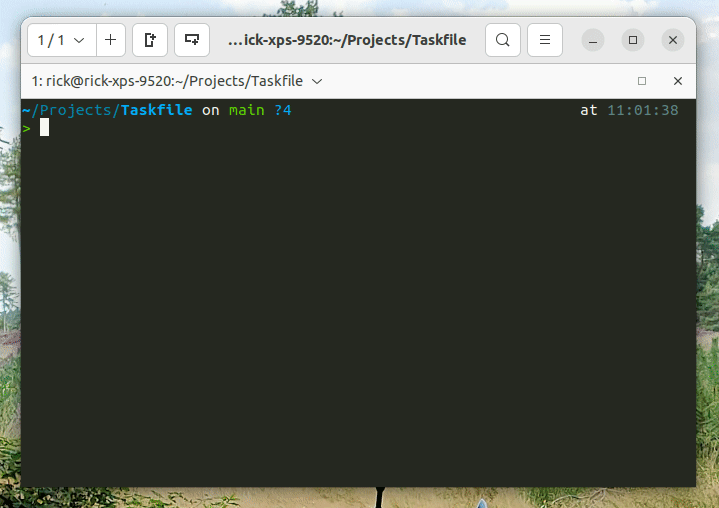

# Taskfile ([taskfile.sh](https://taskfile.sh))

A `./Taskfile` is a task runner in plain and easy [Bash](https://nl.wikipedia.org/wiki/Bash). It adds a list of
available tasks to your project.

Generate your own Taskfile at [taskfile.sh](https://taskfile.sh).

[](https://taskfile.sh)

## Why

- Works on any OS (any bash terminal)
- A uniform way to run your projects
- Very easy to use
- Automate your most common tasks (updating, starting, building, etc...)
- Easy to understand and maintain
- Automatically generated list of available task

## How does it work?

Taskfiles are simple bash scripts, but an easy-to-read function format. There are some things that we need to explain
for our Taskfile setup. It all starts with a `Taskfile`. Download your `Taskfile` from
[taskfile.sh](https://taskfile.sh) and save it. Make sure the Taskfile is executable: `chmod +x ./Taskfile`. You can now
run `./Taskfile` in your terminal.

### Tasks

A task is defined by creating a function that starts with `task:`. This defines a task that can be triggered by running
the `./Taskfile`. Right next to the task, you should add a task definition with two hashes. This will let the
`task:help` function know that you're writing the task function definition. So an example task will look like the
following:

```shell
function task:example { ## Show some example text
    title "Example"
    echo "This is an example task."
}
```

In a task you can call other functions, and run all tooling you desire. Now running `./Taskfile example` will execute
the new task.

### Sections

To group multiple tasks, sections can be created in your Taskfile. A section is created by creating a comment line with
a double hashtag like so:

```shell
## Project section
```

Lines with only a single `#` will not appear as section in `task:help` and can be seen as plain comments.

### Help command

Running `./Taskfile help`, the `task:help` function is triggered. This task will list all available sections and tasks
using the double `##` comments you've learned about above. Now it's clear how you can run any other task!

## Credits

This Taskfile setup is based on [Adrian Cooney's Taskfile](https://github.com/adriancooney/Taskfile) and is widely
adopted by [Enrise](https://enrise.com) in our modified flavour.

## Contributors

A big thanks to all the contributors of Taskfile!


